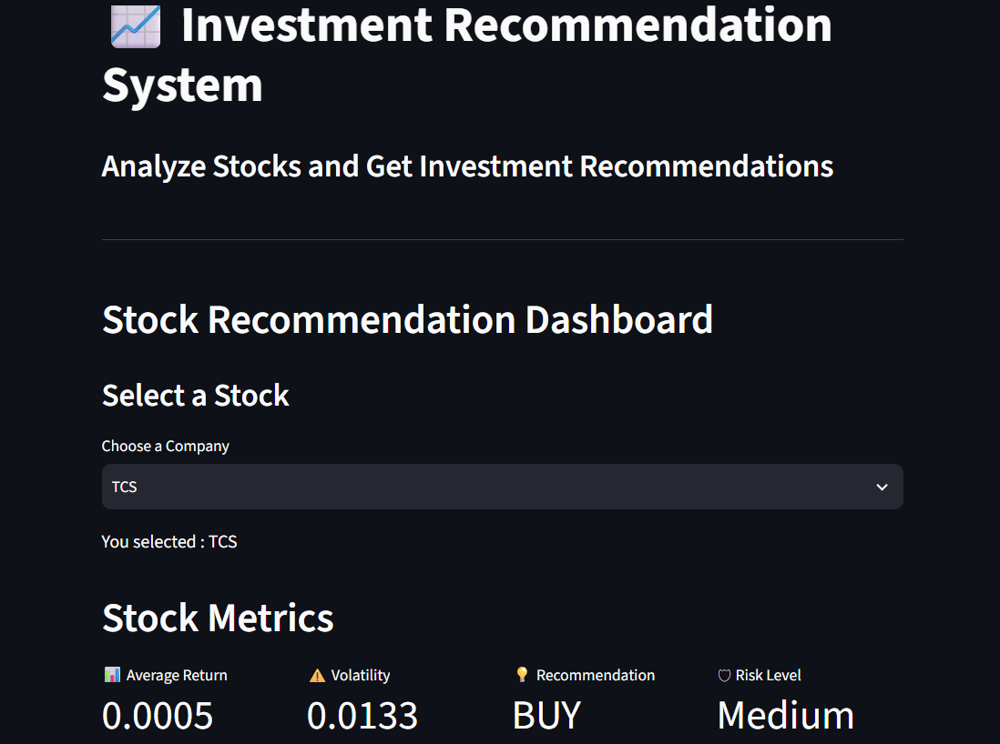
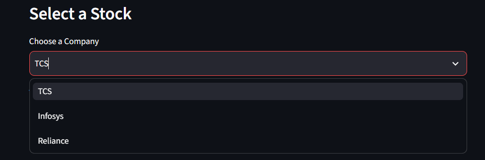
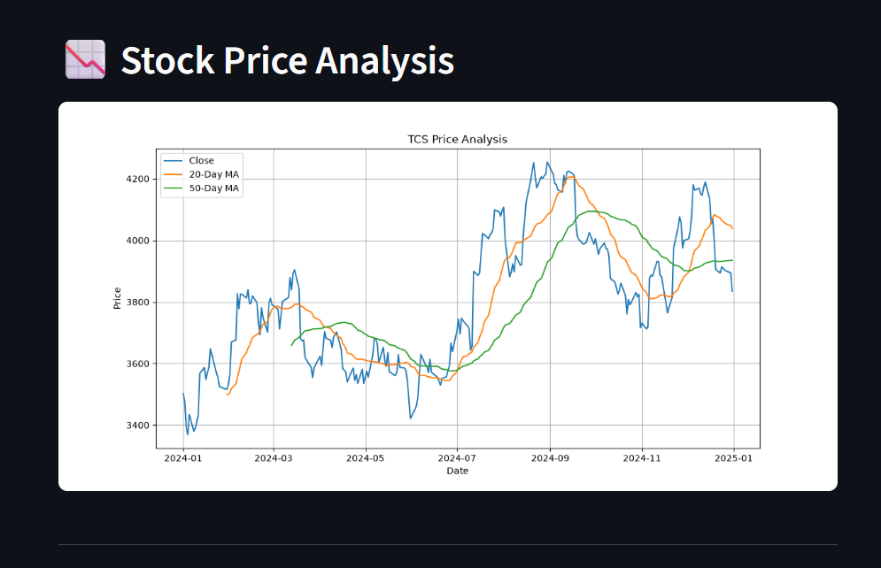
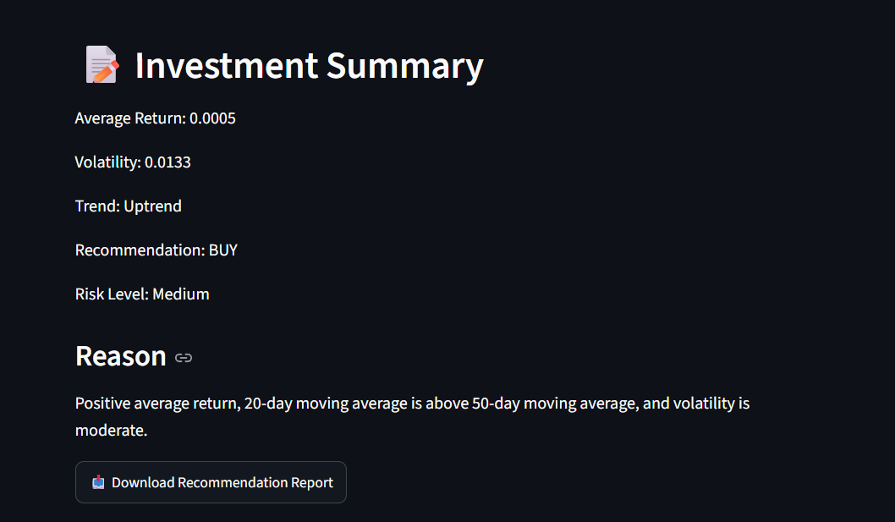

# Investment Recommendation System

A Python-based stock analysis application that analyzes historical stock prices and provides Buy, Hold, or Sell recommendations using financial metrics such as Daily Return, Moving Averages, and Volatility. The project also includes an interactive Streamlit dashboard for visualizing stock performance.


## Table of Contents

- Project Overview
- Features
- Stocks Analyzed
- Technologies Used
- Folder Structure
- Workflow
- Installation
- How to Run
- Dashboard Screenshots
- Financial Metrics
- Recommendation Logic
- Future Improvements


## Project Overview

The Investment Recommendation System is designed to help beginner investors understand stock performance using historical market data.

The system downloads stock prices, cleans the data, calculates financial indicators, compares stocks, and generates Buy, Hold, or Sell recommendations through an interactive Streamlit dashboard.


## Features

- Historical stock data collection using yfinance
- Data cleaning and preprocessing
- Daily Return calculation
- 20-Day Moving Average (MA20)
- 50-Day Moving Average (MA50)
- Volatility calculation
- Multi-stock comparison
- Rule-based Buy/Hold/Sell recommendation engine
- Display Risk Level
- Visualize stock trends with charts
- Export recommendation reports
- Interactive Streamlit dashboard

## Stocks Analyzed

- TCS
- Infosys
- Reliance Industries


## Technologies Used

| Technology | Purpose |
|------------|---------|
| Python | Programming Language |
| Pandas | Data Analysis |
| NumPy | Numerical Computations |
| Matplotlib | Data Visualization |
| yfinance | Stock Data Collection |
| Streamlit | Dashboard Development |
| Git | Version Control |
| GitHub | Project Hosting |


## Folder Structure

```text
Investment-Recommendation-System/
│
├── app.py
├── README.md
├── PROJECT_PLAN.md
├── requirements.txt
│
├── src/
│   ├── analysis.py
│   ├── recommendation.py
│   ├── report_generator.py
│   ├── data_collection.py
│   └── data_cleaning.py
│
├── data/
│   ├── raw/
│   └── processed/
│
├── assets/
│
├── reports/
│
└── notebooks/
```

## Workflow

1. Download historical stock data
2. Clean and preprocess the data
3. Calculate financial metrics
4. Compare stock performance
5. Generate Buy/Hold/Sell recommendations
6. Display results using Streamlit
7. Export recommendation reports


## Financial Metrics Used

### Daily Return

Measures the percentage change in stock price from one trading day to the next.

### Moving Average

Used to smooth short-term price fluctuations and identify overall trends.

- MA20
- MA50

### Volatility

Measures the variability of daily returns and is used as a proxy for investment risk.


## Recommendation Logic

### BUY

- Positive average daily return
- MA20 > MA50
- Volatility < 0.02

### HOLD

- Stable returns
- No strong trend

### SELL

- Negative average return
- MA20 < MA50


## Installation

Clone the repository

```bash
git clone <repository-url>
```

Move into the project folder

```bash
cd Investment-Recommendation-System
```

Install dependencies

```bash
pip install -r requirements.txt
```

## How to Run

Start the Streamlit dashboard

```bash
python -m streamlit run app.py
```

The dashboard will open automatically in your browser.

## Dashboard



## Stock Selection



## Chart



## Recommendation




## Future Improvements

- Add more companies
- Fetch live stock prices
- Include company financial statements
- Add valuation ratios (P/E, EPS, ROE)
- News sentiment analysis
- Machine Learning-based recommendation engine


## Author

Anoushka Manota

Chemical Engineering Undergraduate, IIT Dharwad

Investment Recommendation System Project (2026)
